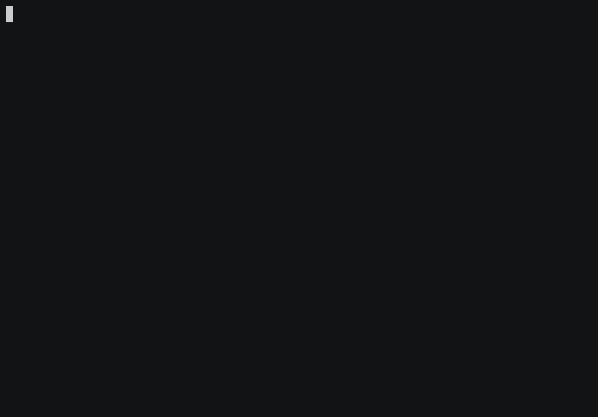

# Natalie

[](https://github.com/natalie-lang/natalie/actions?query=workflow%3ABuild+branch%3Amaster)
[](https://github.com/natalie-lang/natalie/blob/master/LICENSE)
[](https://justforfunnoreally.dev)

Natalie is a very early-stage work-in-progress Ruby implementation.

It provides an ahead-of-time compiler using C++ and gcc/clang as the backend.
Also, the language has a REPL that performs incremental compilation.



There is much work left to do before this is useful. Please let me know if you
want to help!

## Helping Out

Contributions are welcome! You can learn more about how I work on Natalie via
the [hacking session videos on YouTube](https://www.youtube.com/playlist?list=PLWUx_XkUoGTq-nkbhnk6PN4m109ISo5BX).

The easiest way to get started right now would be to find a method on an object
that is not yet implemented and make it yourself! Also take a look at
[good first issues](https://github.com/natalie-lang/natalie/issues?q=is%3Aissue+is%3Aopen+label%3A%22good+first+issue%22).
(See the 'Building' and 'Running Tests' sections below for some helpful steps.)

We have a very quiet [Discord server](https://discord.gg/hnHp2tdQyn) -- come and hang out!

## Building

Natalie is tested on macOS, OpenBSD, and Ubuntu Linux. Windows is not yet supported.

Natalie requires a system Ruby (MRI) to host the compiler, for now.

Prerequisites:

- git
- autoconf
- automake
- libtool
- make
- gcc or clang
- Ruby 2.7.x or Ruby 3.0.x with dev headers
  - Using [rbenv](https://github.com/rbenv/rbenv) to install Ruby is preferred.
  - Otherwise, you'll need the `ruby` and `ruby-dev` package from your system.
- ccache (optional, but recommended)

Install the above prerequisites on your platform, then run:

```sh
git clone https://github.com/natalie-lang/natalie
cd natalie
rake
```

### Troubleshooting Build Errors

- **Don't use `sudo`!** If you already made that mistake, then you should `sudo rm -rf build`
  and try again.
- If you get an error about file permissions, e.g. unable to write a file to somewhere like
  `/usr/lib/ruby`, or another path that would require root, then you have a couple options:
  - Use a tool like [rbenv](https://github.com/rbenv/rbenv) to install a Ruby verison in your
    home directory. Gems will also be installed there. Run `rbenv version` to see which version
    is currently selected. Run `rbenv shell` followed by a version to select that version.
  - Specify where to install gems with something like:
    ```
    mkdir -p ~/gems
    export GEM_HOME=~/gems
    ```
    You'll just have to remember to do that every time you open a new terminal tab.
- If you get an error about missing `bundler`, then your operating system probably didn't
  install it alongside Ruby. You can run `gem install bundler` to get it.

**NOTE:** Currently, the default build is the "debug" build, since Nataile is in active development.
But you can build in release mode with `rake build_release`.

## Usage

**REPL:**

```sh
bin/natalie
```

**Run a Ruby script:**

```sh
bin/natalie examples/hello.rb
```

**Compile a file to an executable:**

```sh
bin/natalie examples/hello.rb -c hello
./hello
```

## Using With Docker

```
docker build -t natalie .                                            # build image
docker run -it --rm natalie                                          # repl
docker run -it --rm natalie -e "p 2 * 3"                             # immediate
docker run -it --rm -v$(pwd)/myfile.rb:/myfile.rb natalie /myfile.rb # execute a local rb file
docker run -it --rm --entrypoint bash natalie                        # bash prompt
```

## Running Tests

To run a test (or spec), you can run it like a normal Ruby script:

```sh
bin/natalie spec/core/string/strip_spec.rb
```

This will run the tests and tell you if there are any failures.

If you want to run all the tests that we expect to pass, you can run:

```sh
rake test
```

Lastly, if you need to run a handful of tests locally, you can use the
`test/runner.rb` helper script:

```sh
bin/natalie test/runner.rb test/natalie/if_test.rb test/natalie/loop_test.rb
```

### What's the difference between the 'spec/' and 'test/' directories?

The files in `spec/` come from the excellent [ruby/spec](https://github.com/ruby/spec)
project, which is a community-curated repo of test files that any Ruby
implementation can use to compare its conformance to what MRI (Matz's Ruby
Interpreter) does. We copy specs over as we implement the part of the language
that they cover.

Everything in `test/` is stuff we wrote while working on Natalie. These are
tests that helped us bootstrap certain parts of the language and/or weren't
covered as much as we would like by the official Ruby specs. We use this
to supplement the specs in `spec/`.

## Copyright & License

Natalie is copyright 2021, Tim Morgan and contributors. Natalie is licensed
under the MIT License; see the `LICENSE` file in this directory for the full text.

Some parts of this program are copied from other sources, and the copyright
belongs to the respective owner:

| file(s)                       | copyright                         | license           |
| ----------------------------- | --------------------------------- | ----------------- |
| `dtoa.c`                      | David M. Gay, Lucent Technologies | custom permissive |
| `fiber_object.*`              | Evan Jones                        | MIT               |
| `big_int.*`                   | Syed Faheel Ahmad                 | MIT               |
| `spec/*` (see `spec/LICENSE`) | Engine Yard, Inc.                 | MIT               |
| `version.rb`                  | Engine Yard, Inc.                 | MIT               |

See each file above for full copyright and license text.
